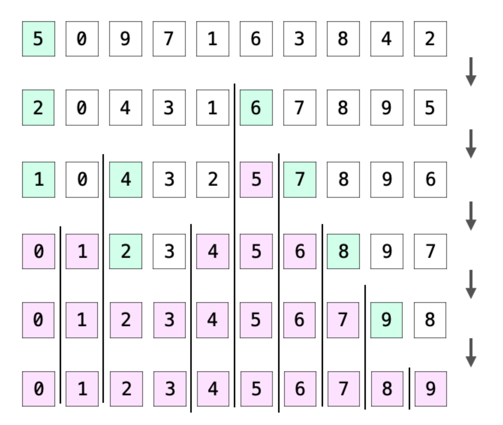

## 目的
- 今までバブルソートでいいやと思って生きてきたけど、ちゃんとクイックソートやってみたら全然組めなかったんでちゃんと理解、復習しよう

## 参考
- [クイックソートを図を使って分かりやすく解説（C言語サンプルプログラム付き）](https://daeudaeu.com/quicksort/)
- 
- 今回の実装では、pivot に指定するのは配列の最後の値としているので画像と一部異なる

## 必要な考え
- pivot を決めること
- pivot を基準に並び替えること
- 並び替えたら再び pivot を選んで並び替えること
- この操作を要素の数が 1 になるまで再帰で行うこと