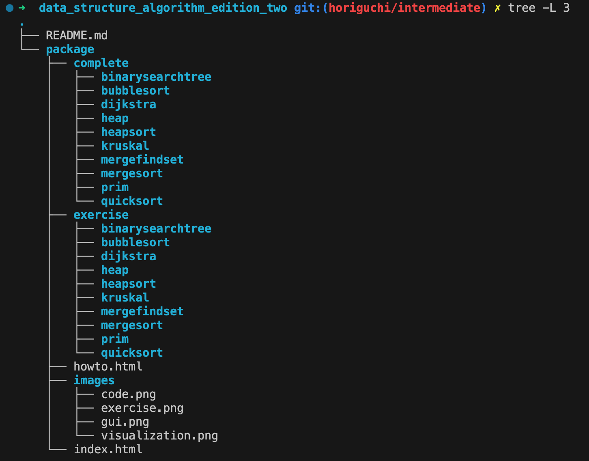

# 背景
- [ソフトウェアエンジニアリング協会](https://www.swe.or.jp/) に参加してきました
- コーディングインタビューを生で見ました
- Google のエンジニアが何を選考基準として大切にしているのかを実感できた5時間でした
- 使われていたデータ構造を知らなかったので、「汎用的なアルゴリズムやデータ構造が載っている書籍を教えてください」と質問し、答えて頂きました
- そこで進められたのが以下の書籍です
- [データ構造とアルゴリズム［第2版](https://www.saiensu.co.jp/search/?isbn=978-4-86481-085-2&y=2022)

# 目的
- 紹介して頂いた書籍とその補助として用意されているデモプログラムを実際に書くことを通して、汎用的なアルゴリズムの綺麗なコードを学ぶことを目的とします
- [学習の仕方](https://www-ui.is.s.u-tokyo.ac.jp/~takeo/book/algorithm/howto.html) に従い、サンプルコードを含むディレクトリ群をDLして進めます

# 言語
- C を学ぶためのレポジトリですが、ここで使うのは Java です
- Java のバージョンも含め、使われているのが古いですが openjdk の最新バージョンで進めていきます

# ディレクトリ構造
