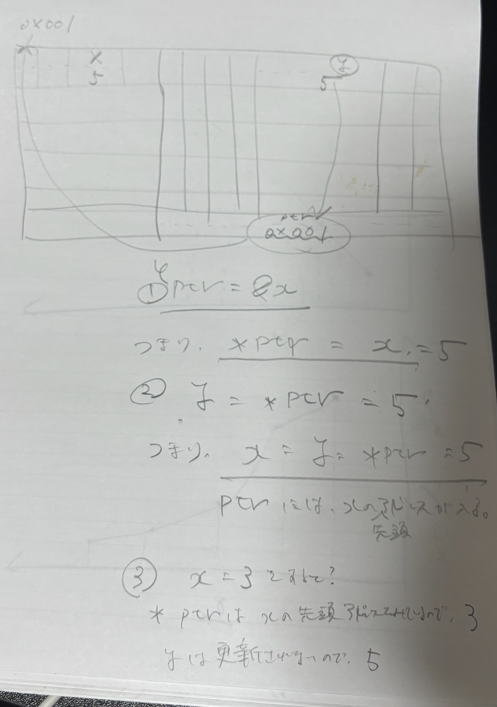

# [3.10 Pointer Operators](https://www.gnu.org/software/gnu-c-manual/gnu-c-manual.html#Pointer-Operators)

```C
#include <stdio.h>

int main(int argc, char const *argv[])
{
    int x = 5;
    int y;
    int *ptr;

    ptr = &x;

    y = *ptr; // saved ptr value which is equal to x value 

    printf("x value: %d\n", x);
    printf("ptr vablue: %d\n", *ptr);
    printf("y value: %d\n", y);

    x = 3;
    printf("x value: %d\n", x);
    printf("ptr vablue: %d\n", *ptr);
    printf("y value: %d\n", y); 

    return 0;
}
```

# Output
```terminal
x value: 5
ptr vablue: 5
y value: 5
x value: 3
ptr vablue: 3
y value: 5
```

# メモリで何が起きているのか？

